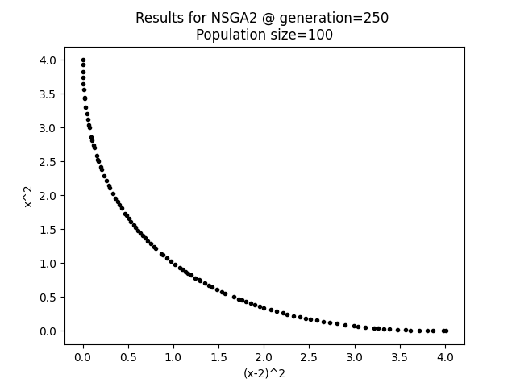
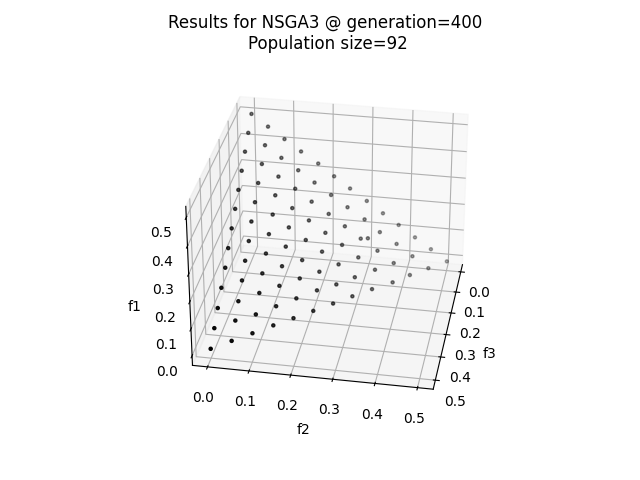
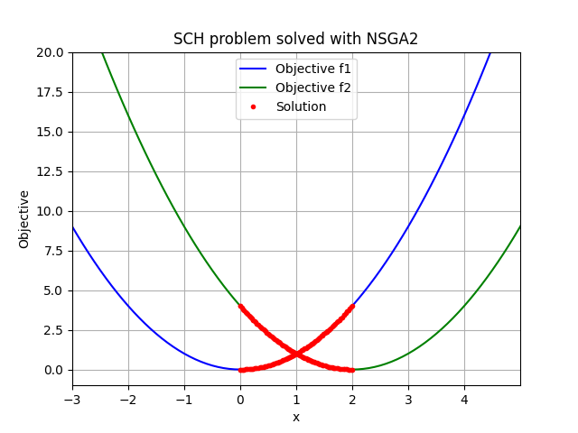

# Optirustic

[](https://crates.io/crates/optirustic)
[](https://docs.rs/optirustic)

<p align="center">
    
    
</p>

Optirustic is a framework written in Rust that provides algorithms and
analysis tool to solve multi-objective problems using multi-objective
evolutionary algorithms (MOEAs). It allows you to:

- define minimisation and maximisation problems with custom objective functions;
- define constraint and unconstrained variables (real, integer, boolean or choice);
- use multi-thread to evaluate objectives and constraints on population with many individuals
- export the population history as JSON and resume its evolution from file
- generate charts with the dedicated [Python package](https://pypi.org/project/optirustic/)

The library comes with the following
algorithms: [`NSGA2`](https://docs.rs/optirustic/latest/optirustic/algorithms/struct.NSGA2.html),
[`NSGA3`](https://docs.rs/optirustic/latest/optirustic/algorithms/struct.NSGA3.html) and
[`AdaptiveNSGA3`](https://docs.rs/optirustic/latest/optirustic/algorithms/struct.AdaptiveNSGA3.html).

The API documentation is available on [docs.rs](https://docs.rs/optirustic/).
Examples showcasing this library's features are available in
the [examples folder of this repository](examples/nsga2_sch.rs).

## Installing Optirustic

Optirustic is available on [crates.io](https://crates.io/crates/optirustic). The
recommended way to use it is to add a line into your Cargo.toml:

```toml
[dependencies]
optirustic = "*"
```

## Example

### Problem definition

In this example, we are going to solve the Schaffer’s problem with the `NSGA2` algorithm.
The problem aims to minimise the following 2 objectives:

- f<sub>1</sub>(x) = x<sup>2</sup>
- f<sub>2</sub>(x) = (x - 2)<sup>2</sup>

The problem has 1 variable (`x`) bounded to `-1000` and `1000`. The optional solution is expected
to lie in the `[0; 2]` range.

### Problem implementation

The problem is implemented below using the `SCHProblem` struct. When an algorithm runs,
it first generates a set of potential solutions for the problem variables (in this case `x`). It
then calculates the objectives (f<sub>1</sub>(x) and f<sub>2</sub>(x)) in the `Evaluator`
trait exposed by this library.

```rust
#[derive(Debug)]
pub struct SCHProblem;

impl SCHProblem {
    /// Create the problem for the optimisation.
    pub fn create() -> Result<Problem, OError> {
        // define the objectives
        let objectives = vec![
            Objective::new("x^2", ObjectiveDirection::Minimise),
            Objective::new("(x-2)^2", ObjectiveDirection::Minimise),
        ];
        // define the variable
        let variables = vec![VariableType::Real(BoundedNumber::new(
            "x", -1000.0, 1000.0,
        )?)];
        // the problem has no constraints
        let constraints = None;

        let e = Box::new(SCHProblem);
        Problem::new(objectives, variables, constraints, e)
    }

    /// The first objective function
    pub fn f1(x: f64) -> f64 {
        x.powi(2)
    }

    /// The second objective function
    pub fn f2(x: f64) -> f64 {
        (x - 2.0).powi(2)
    }
}

// Implement the function to evaluate the objectives and constraints. The `evaluate`
// function below receives the individuals which contain the variables/solutions `x` 
// proposed by the algorithm. The function must return the evaluated objectives and
// constraints in the `EvaluationResult` struct.
impl Evaluator for SCHProblem {
    fn evaluate(&self, i: &Individual) -> Result<EvaluationResult, Box<dyn Error>> {
        let x = i.get_variable_value("x")?.as_real()?;
        let mut objectives = HashMap::new();
        objectives.insert("x^2".to_string(), SCHProblem::f1(x));
        objectives.insert("(x-2)^2".to_string(), SCHProblem::f2(x));
        Ok(EvaluationResult {
            constraints: None,
            objectives,
        })
    }
}
```

<p align="right">(<a href="#optirustic">back to top</a>)</p>

### Setup and run the genetic algorithm

The code below set up the `NSGA2` algorithm with `100` individuals and will
stop when `250` population generations are reached.

```rust
...

fn main() -> Result<(), Box<dyn Error>> {
    // Setup the NSGA2 algorithm
    let args = NSGA2Arg {
        // use 100 individuals and stop the algorithm at 250 generations
        number_of_individuals: 100,
        stopping_condition: StoppingConditionType::MaxGeneration(MaxGeneration(250)),
        // use default options for the SBX and PM operators
        crossover_operator_options: None,
        mutation_operator_options: None,
        // no need to evaluate the objective in parallel
        parallel: Some(false),
        // do not export intermediate solutions
        export_history: None,
        resume_from_file: None,
        // to reproduce results
        seed: Some(10),
    };
    let mut algo = NSGA2::new(problem, args)?;

    // run the algorithm
    algo.run()?;

    // Export serialised results at last generation
    algo.save_to_json(&PathBuf::from("."), Some("SCH_2obj"))?;

    Ok(())
}
```

The full example is available in the [examples folder of this repository](examples/nsga2_sch.rs) and can be
run using

> cargo run --example nsga2_sch --release

This is the serialised data exported by the
algorithm: [SCH_2obj_NSGA2_gen250.json](examples/results/SCH_2obj_NSGA2_gen250.json)
and these are the plotted solutions:

<div style="text-align: center">
    
</div>

<p align="right">(<a href="#optirustic">back to top</a>)</p>

### Plotting and inspecting data

With the library, you can set
the [`export_history`](https://docs.rs/optirustic/latest/optirustic/algorithms/struct.NSGA2Arg.html#structfield.export_history)
option, to export serialised results as JSON files as the algorithm evolves, or
call [`save_to_json`](https://docs.rs/optirustic/latest/optirustic/algorithms/trait.Algorithm.html#method.save_to_json)
to export the results at the last population evolution.

This crate comes with a companion [Python package](./optirustic-py) to inspect the results
and easily plot the Pareto front or the algorithm convergence. This is how all the charts within
this README file were generated. Have a look at the `py` file in the [example folder](./examples).

# License

This project is licensed under the terms of the MIT license.